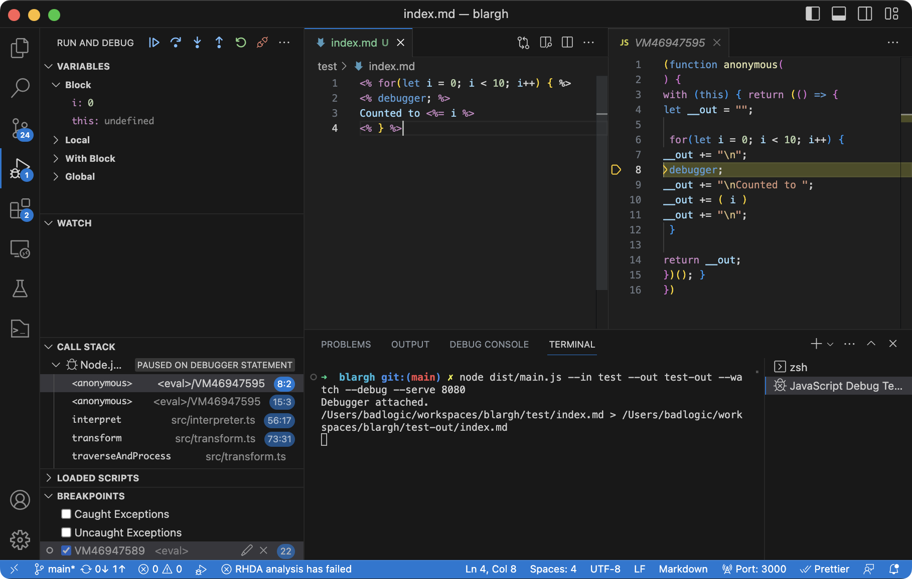

<h1 align="center">blargh</h1>

`blargh` is a programmer's static site generator for creating blogs, documentation, or other static content. It does not impose any rigid structure on your content.

## Installation
### CLI
To install `blargh` globally and make it available on the command line:
```
npm install -g @mariozechner/blargh
```

The `blargh` CLI understands the following arguments:

* `--in <input-directory>` (required): the directory containing the input files
* `--out <output-directory>` (required): the directory to which the output files are written
* `--watch`: Enables watch mode. The output is re-generated any time an input file changes.
* `--serve <port>`: Serves the output directory locally on the given port. Pages opened in a browser will automatically refresh if any output files changed.
* `--extension <ext>`: Additional file extension that should be transformed, e.g. ".txt". By default, `.html`, `.md`, `.css`, and `.js` files are transformed. Any other file type is copied verbatimely.
* `--debug`: Write the generated JavaScript code for a transformed input file to the output directory using the scheme `<input-file-name>.debug.js`, e.g. `index.html` generates `index.html.debug.js`.
* `--version`: outputs the version`

Usually, you'll use this command line:

```bash
blargh --in input --out output --watch --serve 8080
```

### Module
`blargh` is an ES6 module which you can add to your project via your package manager of choice:

```
npm install @mariozechner/blargh
```

**index.mjs**
```javascript
import {blargh, defaultConfig} from "./dist/index.js"

const config = {
    ...defaultConfig,
    inputPath: "input",
    outputPath: "output",
    watch: true,
    serve: true,
    servePort: 8080
}

await blargh(config);
```

This is equivalent to the command line shown in the last section. Deriving from `defaultConfig` ensures that the default transformations and built-in functions are available. See [src/Config.ts](src/config.ts) for more information on what can be passed to `blargh()`.

## Usage

`blargh` takes files in an input directory, optionally transforms them, and copies the resulting files to an output directory. Files and directories starting with `_` are ignored.

Transformations are applied to a fixed set of file types. By default, `.md`, `.html`, `.css`, and `.js` are transformed. Files of other types will be copied to the output directory verbatim.

By default, `.md` files are transformed to `.html` files via [Marked](https://marked.js.org/). Code blocks inside `.md` files are converted to HTML via [highlight.js](https://highlightjs.org/).

> **Note**: indented code blocks are disabled in `blargh`'s Markdown support. Always use [fenced code blocks](https://docs.github.com/en/get-started/writing-on-github/working-with-advanced-formatting/creating-and-highlighting-code-blocks#fenced-code-blocks).

The content of transformed file types can include arbitrary multi-line JavaScript code in between `<%` and `%>` tags. Code inbetween `<%=` and `%>` is expected to be a JavaScript expression that evaluates to a string. Think PHP, but with JavaScript:

**input/hello.md**
````markdown
# Hello world

This site was generated on <%= new Date().toString() %>

<% for (let i = 0; i < 10; i++) { %>
Count <%= i %>
<% } %>

Here's "Hello, world!" in JavaScript:

```
console.log("Hello, world!")
```
````

`blargh` will compile a small JavaScript program from this input:

```javascript
(() => {
let __out = "";

__out += "# Hello world\n\nThis site was generated on ";
__out += ( new Date().toString() )
__out += "\n\n";
 for (let i = 0; i < 10; i++) {
__out += "\nCount ";
__out += ( i )
__out += "\n";
 }
__out += "\n\nHere's \"Hello, world!\" in JavaScript:\n\n```javascript\nconsole.log(\"Hello, world!\")\n```";

return __out;
})()
```

`blargh` then runs this JavaScript program to generate the final output:

**output/hello.html**
```html
<h1>Hello world</h1>
<p>This site was generated on Fri Jul 12 2024 16:08:50 GMT+0200 (Central European Summer Time)</p>
<p>Count 0</p>
<p>Count 1</p>
<p>Count 2</p>
<p>Count 3</p>
<p>Count 4</p>
<p>Count 5</p>
<p>Count 6</p>
<p>Count 7</p>
<p>Count 8</p>
<p>Count 9</p>
<p>Here&#39;s &quot;Hello, world!&quot; in JavaScript:</p>
<pre><code class="hljs language-javascript"><span class="hljs-variable language_">console</span>.<span class="hljs-title function_">log</span>(<span class="hljs-string">&quot;Hello, world!&quot;</span>)
</code></pre>
```

## Built-in properties and functions
`blargh` comes with a minimal set of built-in properties and functions that are available to the JavaScript code in transformed files.

### File properties
JavaScript code inside a transformed file has access to basic information about the file in form of properties on the `this` object. You can directly access them without having to reference `this`. The following properties are available:

* `inputPath: string`: the absolute path of the current file
* `outputPath: string`: the absolute path to which the transformed content of the current file will be written
* `content: string`: the current file's original content

E.g., to output the current file's name:

**index.md**
```
Hi, my file name is <%= inputPath %>
```

Which results in:

**index.html**
```
<p>Hi, my file name is /Users/badlogic/workspaces/blargh/test.md</p>
```

> **Note:** while it is possible to modify the `outputPath` from within the JavaScript code, it is *NOT* recommended or supported!

### meta(filePath?: string): void
Reads the file given relative to the current file, or `./meta.json` if no file path was given. The file is assumed to be a valid JSON file, containing an object, with arbitrarily nested properties. The object's properties are assigned to `this`, exposing them to the JavaScript code in the current file.

This mechanism is a good fit for storing and loading metadata for e.g. a blog post:

**meta.json**
```json
{
    "title": "My first post",
    "author": "Mario",
    "date": "2024-07-12"
}
```

**index.md**
```
<% meta() %>

# <%= title %>
<span>By <%= author %>, <%= date %><span>

Lorem ipsum ...
```

Which will generate this output:
**index.html**
```
<h1>My first post</h1>
<p><span>By Mario, 2024-07-12<span></p>
<p>Lorem ipsum ...</p>
```

### render(filePath: string, context?: any): string
Reads and transforms the file given relative to the current file, and returns the final result as a string. Properties defined on the `this` object in the current file and properties in the optional `context` parameter are merged, and exposed to the JavaScript code inside the included file.

`render()` is useful to share fragments across pages, e.g. headers and footers:

**_header.html**
```html
<!DOCTYPE html>
<html>

<head>
    <meta charset="UTF-8">
    <meta name="viewport" content="width=device-width, initial-scale=1.0">
    <title><%= title %></title>
    <link rel='stylesheet' href='/style.css'>
</head>

<body>
    <div class="container">
```

**_footer.html**
```html
    </div>
</body>
</html>
```

Which we can then re-use on any page:

**index.md**
```markdown
<%= render("./_header.html", { title: "My Blargh" }) %>

# Welcome
Welcome to my blargh. Please enjoy the wonderful header and footer.

<%= render("./_footer.html") %>
```

**about.md**
```markdown
<%= render("./_header.html", { title: "My Blargh - About" }) %>

# About
It'se me, Mario!

<%= render("./_footer.html") %>
```

Which results in:

**index.html**
```html
<!DOCTYPE html>
<html>
  <head>
    <meta charset="UTF-8">
    <meta name="viewport" content="width=device-width, initial-scale=1.0">
    <title>My Blargh</title>
    <link rel='stylesheet' type='text/css' media='screen' href='/style.css'>
  </head>
  <body>
    <div class="container">
      <h1>Welcome</h1>
      <p>Welcome to my blargh. Please enjoy the wonderful header and footer.</p>
    </div>
  </body>
</html>
```
**about.html**
```html
<!DOCTYPE html>
<html>
  <head>
    <meta charset="UTF-8">
    <meta name="viewport" content="width=device-width, initial-scale=1.0">
    <title>My Blargh - About</title>
    <link rel='stylesheet' type='text/css' media='screen' href='/style.css'>
  </head>
  <body>
    <div class="container">
      <h1>About</h1>
      <p>It&#39;se me, Mario!</p>
    </div>
  </body>
</html>
```

### require(id: string): any
Pass through to Node.js' [`require()`](https://nodejs.org/api/modules.html#requireid) to load a module. With this, you can include any code from your project local or global `node_modules/` folders, as well as built-in Node.js modules. E.g.

**index.md**
```markdown
<%
const fs = require("fs");
const lastModified = fs.statSync(inputPath).mtime;
%>
Last changed: <%= lastModified %>
```

Which gives:

**index.html**
```html
<p>Last changed: Fri Jul 12 2024 19:17:46 GMT+0200 (Central European Summer Time)</p>
```

### metas(dirPath: string): { directory: string, meta: any }[]
Recursively finds all `meta.json` files in the directory given relative to the current file and returns them as a list of objects, consisting of the content of the `meta.json` file and its parent directory relative to the `dirPath`.

This utility function is aimed at use cases, where you want to enumerate all pages' metadata and output them in some form, like an index of all blog posts:

```
posts/
   first-post/
      index.md
      meta.json
   second-post/
       index.md
       meta.json
    ...
index.md
```

Assuming the `meta.json` files of each post look like this:

```
{
    "title": "Some title",
    "teaser": "Lorem ipsum ...",
    "date": "2024-07-12"
}
```

The `index.md` file in the root folder could list all blog posts for navigational purposes like this:

```markdown
<%
// Sort the posts by date, descending.
const posts = metas("./posts");
posts.sort((a, b) => b.meta.date.localeCompare(a.meta.date));
%>

<% for(const post of posts) { %>
# [<%=post.meta.title%>](/posts/<%=post.directory%>)
<%=post.meta.teaser%>
<% } %>
```

Which yields:

**index.html**
```html
<h1><a href="/posts/second-post">Title of the second post</a></h1>
<p>The quick brown fox jumps ...</p>
<h1><a href="/posts/first-post">Some title</a></h1>
<p>Lorem ipsum ...</p>
```

> **Note:** Due to the way Markdown parsing works, the lines inside the `for` loop are not indented! You can also achieve the same result using

### rss(filePath: string, channel: RssChannel, items: RssItem[])
Generates an RSS file using the channel and items information. `RssChannel` and `RssItem `are defined as:

```typescript
export type RssChannel = { title: string; description: string; url: string };
export type RssItem = { title: string; description: string; pubdate: string; url: string };
```

Continuing with the above example, we can generate an `rss.xml` file based on the posts meta data:


```markdown
<%
const posts = metas("./posts");
posts.sort((a, b) => b.meta.date.localeCompare(a.meta.date));

const channel = {
    title: "My Blargh",
    description: "It's a very good blargh.",
    url: "https://myblargh.com"
}
const items = posts.map((p) => {
    return {
        title: p.meta.title,
        description: p.meta.teaser,
        pubdate: p.meta.date,
        url: channel.url + `/posts/${p.directory}`
    }
})
rss("./rss.xml", channel, items);
%>

... Rest as before ...
``````

The `rss.xml` file will look like this:

```xml
<?xml version="1.0" encoding="UTF-8" ?>
  <rss version="2.0">

      <channel>
        <title>My Blargh</title>
        <link>https://myblargh.com</link>
        <description>It&apos;s a very good blargh.</description>

          <item>
            <title>Title of the second post</title>
            <link>https://myblargh.com/posts/second-post</link>
            <description>The quick brown fox jumps ...</description>
            <pubDate>Mon, 15 Jul 2024 00:00:00 GMT</pubDate>
          </item>

          <item>
            <title>Some title</title>
            <link>https://myblargh.com/posts/first-post</link>
            <description>Lorem ipsum ...</description>
            <pubDate>Fri, 12 Jul 2024 00:00:00 GMT</pubDate>
          </item>

      </channel>

  </rss>
```

## Debugging in VS Code

`blargh` generates a JavaScript program for each transformed file, to "interpret" the inline JavaScript. To debug such a program:

1. Open your project root folder in VS Code.
1. Put `<% debugger; %>` anywhere in the file.
1. Open a `JavaScript Debug Terminal` in VS Code and navigate to your project.
1. Run `blargh` in the terminal.

VS Code will automatically connect to the Node.js process and stop at the `debugger;` statement. You can inspect variables and step around the code, including the `blargh` code itself.

## Extending `blarg`
You can extend `blargh` in three ways:

1. Use `require()` in your JavaScript expressions to pull in external code.
1. Add "built-in" functions, so you do not have to write `require()` in your JavaSCript expressions.
1. Add transformers, which can post-process the output of previous transformers before the result is written to disk. E.g. to prettify or minify files.

### Adding built-in functions
This is achieved by appending one or more [`ContextExtender`](src/context.ts#L24) to `config.contextExtenders`. A `ContextExtender` is a function that receives a [`Config`](src/config.ts) and [`Context`](src/context.ts) for the current transformed file and can add properties to the context, which will be available to the JavaScript expressions:

**index.mjs**
```javascript
import {blargh, defaultConfig} from "./dist/index.js"

const config = {
    ...defaultConfig,
    inputPath: "input",
    outputPath: "output",
    watch: true,
    serve: true,
    servePort: 8080
}

// Add a custom function callable from JavaScript expressions.
config.contextExtenders.push((config, context) => {
  context.funny = () => {
    return `A super funny string generated in file ${context.inputPath}`
  }
});

await blargh(config);
```

Given an input file like:

**index.md**
```markdown
<%= funny() %>
```

And running `index.mjs` via:

```
node index.mjs
```

The output will be:

**index.html**
```
<p>A super funny string generated in file /Users/badlogic/workspaces/blargh/test/index.md</p>
```

Check the [default built-in context extender](src/context.ts#L40) for an example with more complexity.

### Adding transformers
This is achieved by appending one or more [`Transformer`](src/transform.ts#L47) to `config.transformers`. A `Transformer` is a function that receives a [`Config`](src/config.ts), a [`Context`](src/context.ts) for the current transformed file, and the content that would currently be output for the input file. The transformer then generates new content to be output based on the previous content.

A transformer is invoked after the JavaScript in a file has been evaluated.

The [MarkdownTransformer](src/transform.ts#L50) is a good example. It checks if the input file is a `.md` file, then transforms the content to HTML via the Marked library. It also modifies the `outputPath` to have a `.html` suffix instead of the original `.md`.